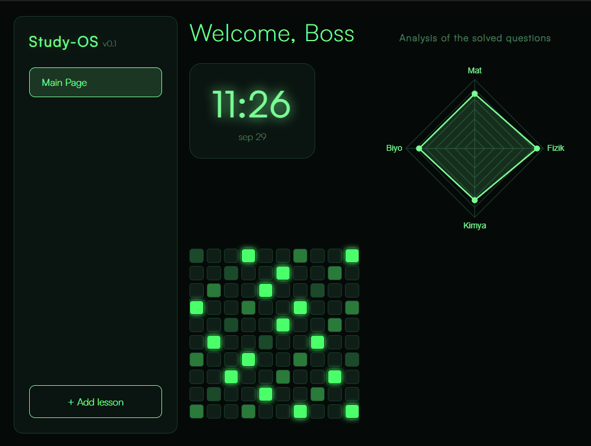

# Study-OS

 **Study-OS** is a minimalist, cyberpunk-themed productivity dashboard designed to help students track their study habits, question-solving progress, and a little motivation:)




## Features

-  **Subject & Question Tracking:** Log the subjects (Math, Physics, Chemistry, Biology) and the number of questions solved per session.
- **Radar Chart Analysis:** Visualize your performance balance across different subjects with a dynamic radar chart.
- **100-Day Contribution Grid:** A GitHub-style heatmap that lights up with a brighter neon green as you solve more questions each day.
- **Live System Clock:** Real-time clock display with a sleek neon glow, keeping you aware of your study time.

##  Tech Stack

### Core
- **Framework:** [Tauri](https://tauri.app/) (Rust-based Desktop Framework)
- **Backend Language:** [Rust](https://www.rust-lang.org/)
- **Frontend Language:** HTML5, CSS3, JavaScript 

### UI & Visualization
- **Charts:** Chart.js 
- **Styling:** Custom CSS 

### Data & Storage
- **Local Storage:** [Tauri Store Plugin](https://github.com/tauri-apps/tauri-plugin-store) *(veya LocalStorage / SQLite)*
---

##  Getting Started

1. **Clone the repository:**
   ```bash
   git clone https://github.com/your-username/study-os.git
   ```

2. **Navigate to the project folder:**
   ```bash
   cd study-os
   ```

3. **Install dependencies:**
   ```bash
   npm install
   ```

4. **Run the app:**
   ```bash
   npm run tauri dev
   ```

>Also,The installer will be available in src-tauri/target/release/bundle/

---

## How to Use

**Add a Subject:** Click the **+Add Subject** button at the bottom left to add a new subject.

**Log Your Progress:** Enter the number of questions you solved.

**Watch the Grid Glow:** Each day you solve questions, a square in the 100-day grid lights up brighter.

**Analyze Your Balance:** Check the radar chart on the right to see which subject needs more attention.

## Contributing

Contributions, issues, and feature requests are welcome!
Feel free to check the issues page.


## License
This project is licensed under the **GNU General Public License v3.0**. 
See the [LICENSE](./LICENSE) file for more details.

## Author

GitHub: @Roi-0853